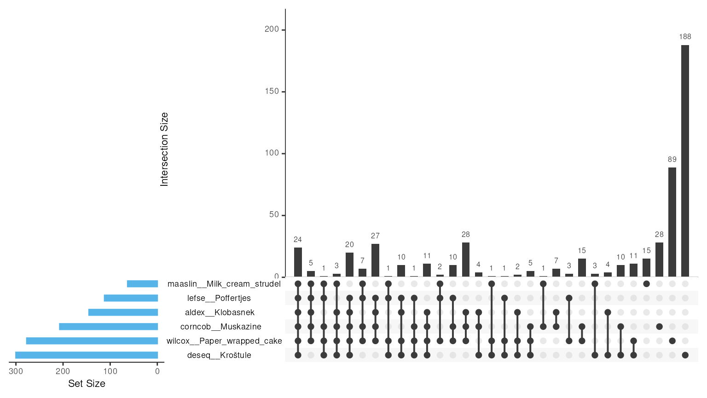
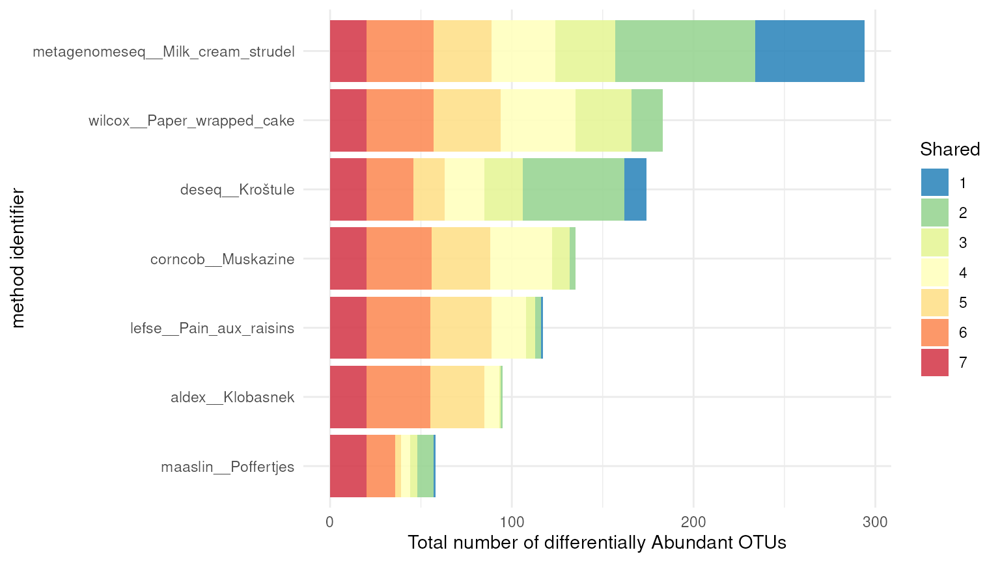
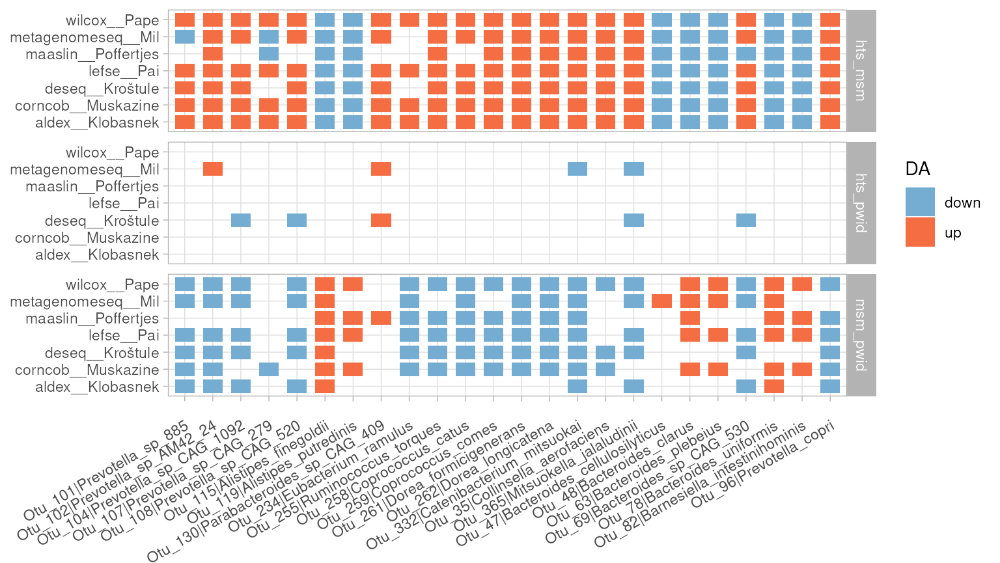
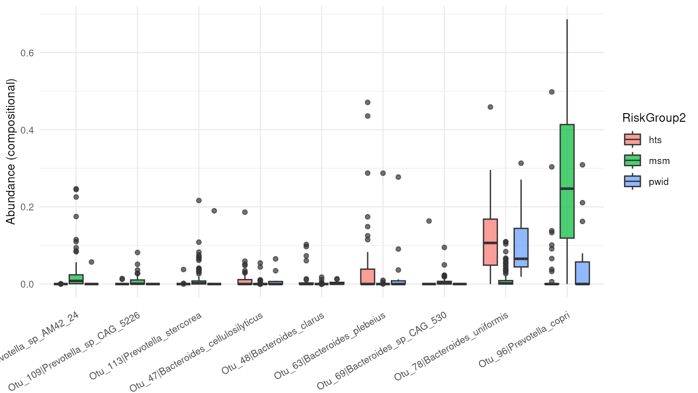
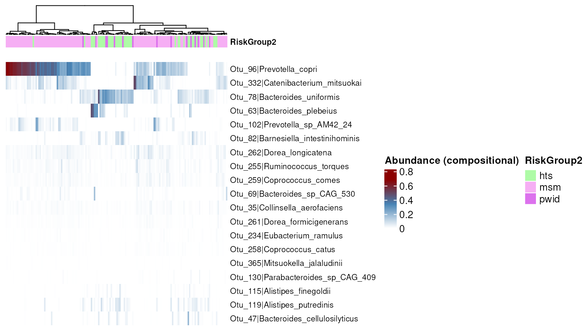

# dar: Case of Study

## Introduction

To illustrate the functionality of the dar package, this study will use
the data set from (Noguera-Julian, M., et al. 2016). The authors of this
study found that men who have sex with men (MSM) predominantly belonged
to the Prevotella-rich enterotype whereas most non-MSM subjects were
enriched in Bacteroides, independently of HIV-1 status. This result
highlights the potential impact of sexual orientation on the gut
microbiome and emphasizes the importance of controlling for such
variables in microbiome research. Using the dar package, we will conduct
a differential abundance analysis to further explore this finding and
uncover potential microbial biomarkers associated with this specific
population.

## Load dar package and data

``` r

library(dar)
data("metaHIV_phy")
set.seed(1234)

metaHIV_phy
#> phyloseq-class experiment-level object
#> otu_table()   OTU Table:         [ 451 taxa and 156 samples ]
#> sample_data() Sample Data:       [ 156 samples by 3 sample variables ]
#> tax_table()   Taxonomy Table:    [ 451 taxa by 7 taxonomic ranks ]
```

## Recipe Initialization

To begin the analysis process with the `dar` package, the first step is
to initialize a Recipe object, which is an S4 class. This recipe object
serves as a blueprint for the data preparation steps required for the
differential abundance analysis. The initialization of the recipe object
is done through the function
[`recipe()`](https://microbialgenomics-irsicaixaorg.github.io/dar/reference/recipe.md),
which takes as inputs a `phyloseq` or `TreeSummarizedExperiment` (TSE)
object, the name of the categorical variable of interest and the
taxonomic level at which the differential abundance analyses are to be
performed. As previously mentioned, we will use the data set from
(Noguera-Julian, M., et al. 2016) and the variable of interest
“RiskGroup2” containing the categories: men who have sex with men (msm),
non-MSM (hts) and people who inject drugs (pwid) and we will perform the
analysis at the species level.

``` r

# Recipe Initialization
rec <- recipe(metaHIV_phy) |>
  add_model(~ RiskGroup2, targets = "RiskGroup2", tax_level = "Species")
rec
#> ── DAR Recipe ──────────────────────────────────────────────────────────────────
#> Inputs:
#> 
#>      ℹ phyloseq object with 451 taxa and 156 samples 
#>      ℹ variable of interes RiskGroup2 (class: character, levels: hts, msm, pwid) 
#>      ℹ taxonomic level Species 
#> 
#> Statistical model:
#> 
#>      ℹ ~RiskGroup2
```

## Recipe QC and Preprocessing Steps Definition

Once the recipe object has been initialized, the next step is to
populate it with steps. Steps are the methods that will be applied to
the data stored in the recipe. There are two types of steps:
preprocessing (prepro) and differential abundance (da) steps. Initially,
we will focus on the prepro steps which are used to modify the data
loaded into the recipe, which will then be used for the da steps. The
`dar` package includes 3 main preprocessing functionalities:
`step_subset_taxa`, which is used for subsetting columns and values in
the taxon table connected to the phyloseq object, `step_filter_taxa`,
which is used to filter the OTUs, and `step_rarefaction`, which is used
to resample the OTU table to ensure that all samples have the same
library size. These functionalities allow for a high level of
flexibility and customization in the data preparation process before
performing the differential abundance analysis.

The dar package provides convenient wrappers for the step_filter_taxa
function, designed to filter Operational Taxonomic Units (OTUs) based on
specific criteria: prevalence, variance, abundance, and rarity.

- `step_filter_by_prevalence`: Filters OTUs according to the number of
  samples in which the OTU appears.
- `step_filter_by_variance`: Filters OTUs based on the variance of the
  OTU’s presence across samples.
- `step_filter_by_abundance`: Filters OTUs according to the OTU’s
  abundance across samples.
- `step_filter_by_rarity`: Filters OTUs based on the rarity of the OTU
  across samples.

In addition to the preprocessing steps,
[`recipe_qc()`](https://microbialgenomics-irsicaixaorg.github.io/dar/reference/recipe_qc.md)
returns overall or explicitly grouped metrics that support informed
preprocessing decisions. In our case, we decided to use the
`step_subset_taxa` function to retain only those observations annotated
within the realm of Bacteria and Archaea. We also used the
`step_filter_by_prevalence` function to retain only those OTUs with at
least 1% of the samples with values greater than 0. This approach
ensured that we were working with a high-quality, informative subset of
the data, which improved the overall accuracy and reliability of the
differential abundance analysis.

``` r

# Summary statistics by analysis group
recipe_qc(rec, group_by = "RiskGroup2")
#> # A tibble: 4 × 13
#>   group_by   group     n n_zero pct_zero pct_all_zero pct_singletons
#>   <chr>      <chr> <dbl>  <dbl>    <dbl>        <dbl>          <dbl>
#> 1 NA         NA    70356  57632     81.9          0             20.6
#> 2 RiskGroup2 hts   18491  15108     81.7         24.2           22.8
#> 3 RiskGroup2 msm   45100  37019     82.1         16.0           20.2
#> 4 RiskGroup2 pwid   6765   5505     81.4         41.2           16.6
#> # ℹ 6 more variables: pct_doubletons <dbl>, n_samples <dbl>,
#> #   lib_size_min <dbl>, lib_size_max <dbl>, count_mean <dbl>, count_max <dbl>

# Adding prepro steps
rec <- 
  rec |>
  step_subset_taxa(tax_level = "Kingdom", taxa = c("Bacteria", "Archaea")) |>
  step_filter_by_prevalence()

rec
#> ── DAR Recipe ──────────────────────────────────────────────────────────────────
#> Inputs:
#> 
#>      ℹ phyloseq object with 451 taxa and 156 samples 
#>      ℹ variable of interes RiskGroup2 (class: character, levels: hts, msm, pwid) 
#>      ℹ taxonomic level Species 
#> 
#> Statistical model:
#> 
#>      ℹ ~RiskGroup2 
#> 
#> Preprocessing steps:
#> 
#>      ◉ step_subset_taxa() id = subset_taxa__Bridie 
#>      ◉ step_filter_by_prevalence() id = filter_by_prevalence__Gujiya 
#> 
#> DA steps:
```

## Define Differential Analysis (DA) steps

Once data is preprocessed and cleaned, the next step is to add the da
steps. The dar package incorporates multiple methods to analyze the
data, including: `ALDEx2`, `ANCOM-BC`, `corncob`, `DESeq2`, `Lefse`,
`LinDA`, `MaAsLin3`, and `Wilcox`. These methods provide a range of
options for uncovering potential microbial biomarkers associated with
the variable of interest. To ensure consistency across methods, we
decided not to use default parameters, but to set the `min_prevalence`
parameter to 0 for `MaAsLin3`. This approach ensured that the analysis
was consistent across methods and that the results were interpretable.

``` r

# DA steps definition
rec <- 
  rec |> 
  step_wilcox() |>
  # step_ancom() |>
  step_aldex() |>
  step_deseq() |>
  step_corncob(filter_discriminant = FALSE) |> 
  step_maaslin(min_prevalence = 0) |> 
  step_lefse()
#> Warning: ! The centralized model overrides design arguments in 1 step.
#> ℹ corncob__Muskazine: formula_null
#> ℹ Method-specific thresholds and preprocessing controls are unchanged.

rec
#> ── DAR Recipe ──────────────────────────────────────────────────────────────────
#> Inputs:
#> 
#>      ℹ phyloseq object with 451 taxa and 156 samples 
#>      ℹ variable of interes RiskGroup2 (class: character, levels: hts, msm, pwid) 
#>      ℹ taxonomic level Species 
#> 
#> Statistical model:
#> 
#>      ℹ ~RiskGroup2 
#> 
#> Preprocessing steps:
#> 
#>      ◉ step_subset_taxa() id = subset_taxa__Bridie 
#>      ◉ step_filter_by_prevalence() id = filter_by_prevalence__Gujiya 
#> 
#> DA steps:
#> 
#>      ◉ step_wilcox() id = wilcox__Paper_wrapped_cake 
#>      ◉ step_aldex() id = aldex__Klobasnek 
#>      ◉ step_deseq() id = deseq__Kroštule 
#>      ◉ step_corncob() id = corncob__Muskazine 
#>      ◉ step_maaslin() id = maaslin__Milk_cream_strudel 
#>      ◉ step_lefse() id = lefse__Poffertjes
```

## Prep recipe

Once the `recipe` has been defined, the next step is to execute all the
steps defined in the `recipe.` This is done through the function
[`prep()`](https://microbialgenomics-irsicaixaorg.github.io/dar/reference/prep.md).
Internally, it first executes the preprocessing steps, which modify the
`phyloseq` object stored in the `recipe`. Then, using the modified
`phyloseq`, it executes each of the defined differential abundance
methods. To speed up the execution time, the
[`prep()`](https://microbialgenomics-irsicaixaorg.github.io/dar/reference/prep.md)
function includes the option to run in parallel. The resulting object
has class `PrepRecipe` and when printed in the terminal, it displays the
number of taxa detected as significant in each of the methods and also
the total number of taxa shared across all methods. This allows for a
provisional overview of the results and a comparison between methods.

``` r

# Execute in parallel
da_results <- prep(rec, parallel = TRUE)
#> Warning: Separation detected in abundance model!
#> Likely, one of your covariates/experimental conditions is such that
#> there are all zero counts within a group. The results of this model should
#> be interpreted with care because there is insufficient data to distinguish between groups.
#> Warning: Separation detected in abundance model!
#> Likely, one of your covariates/experimental conditions is such that
#> there are all zero counts within a group. The results of this model should
#> be interpreted with care because there is insufficient data to distinguish between groups.
#> Warning: Separation detected in abundance model!
#> Likely, one of your covariates/experimental conditions is such that
#> there are all zero counts within a group. The results of this model should
#> be interpreted with care because there is insufficient data to distinguish between groups.
#> Warning: Separation detected in abundance model!
#> Likely, one of your covariates/experimental conditions is such that
#> there are all zero counts within a group. The results of this model should
#> be interpreted with care because there is insufficient data to distinguish between groups.
#> Warning: Separation detected in abundance model!
#> Likely, one of your covariates/experimental conditions is such that
#> there are all zero counts within a group. The results of this model should
#> be interpreted with care because there is insufficient data to distinguish between groups.
#> Warning: Separation detected in abundance model!
#> Likely, one of your covariates/experimental conditions is such that
#> there are all zero counts within a group. The results of this model should
#> be interpreted with care because there is insufficient data to distinguish between groups.
#> Warning: Separation detected in abundance model!
#> Likely, one of your covariates/experimental conditions is such that
#> there are all zero counts within a group. The results of this model should
#> be interpreted with care because there is insufficient data to distinguish between groups.
#> Warning: Separation detected in abundance model!
#> Likely, one of your covariates/experimental conditions is such that
#> there are all zero counts within a group. The results of this model should
#> be interpreted with care because there is insufficient data to distinguish between groups.
#> Warning: Separation detected in abundance model!
#> Likely, one of your covariates/experimental conditions is such that
#> there are all zero counts within a group. The results of this model should
#> be interpreted with care because there is insufficient data to distinguish between groups.
#> Warning: Separation detected in abundance model!
#> Likely, one of your covariates/experimental conditions is such that
#> there are all zero counts within a group. The results of this model should
#> be interpreted with care because there is insufficient data to distinguish between groups.
#> Warning: Separation detected in abundance model!
#> Likely, one of your covariates/experimental conditions is such that
#> there are all zero counts within a group. The results of this model should
#> be interpreted with care because there is insufficient data to distinguish between groups.
#> Warning: Separation detected in abundance model!
#> Likely, one of your covariates/experimental conditions is such that
#> there are all zero counts within a group. The results of this model should
#> be interpreted with care because there is insufficient data to distinguish between groups.
#> Warning: Separation detected in abundance model!
#> Likely, one of your covariates/experimental conditions is such that
#> there are all zero counts within a group. The results of this model should
#> be interpreted with care because there is insufficient data to distinguish between groups.
#> Warning: Separation detected in abundance model!
#> Likely, one of your covariates/experimental conditions is such that
#> there are all zero counts within a group. The results of this model should
#> be interpreted with care because there is insufficient data to distinguish between groups.
#> Warning: Separation detected in abundance model!
#> Likely, one of your covariates/experimental conditions is such that
#> there are all zero counts within a group. The results of this model should
#> be interpreted with care because there is insufficient data to distinguish between groups.
#> Warning: Separation detected in abundance model!
#> Likely, one of your covariates/experimental conditions is such that
#> there are all zero counts within a group. The results of this model should
#> be interpreted with care because there is insufficient data to distinguish between groups.
#> Warning: Separation detected in abundance model!
#> Likely, one of your covariates/experimental conditions is such that
#> there are all zero counts within a group. The results of this model should
#> be interpreted with care because there is insufficient data to distinguish between groups.
#> Warning: Separation detected in abundance model!
#> Likely, one of your covariates/experimental conditions is such that
#> there are all zero counts within a group. The results of this model should
#> be interpreted with care because there is insufficient data to distinguish between groups.
#> Warning: Separation detected in abundance model!
#> Likely, one of your covariates/experimental conditions is such that
#> there are all zero counts within a group. The results of this model should
#> be interpreted with care because there is insufficient data to distinguish between groups.
#> Warning: Separation detected in abundance model!
#> Likely, one of your covariates/experimental conditions is such that
#> there are all zero counts within a group. The results of this model should
#> be interpreted with care because there is insufficient data to distinguish between groups.
#> Warning: Separation detected in abundance model!
#> Likely, one of your covariates/experimental conditions is such that
#> there are all zero counts within a group. The results of this model should
#> be interpreted with care because there is insufficient data to distinguish between groups.
#> Warning: Separation detected in abundance model!
#> Likely, one of your covariates/experimental conditions is such that
#> there are all zero counts within a group. The results of this model should
#> be interpreted with care because there is insufficient data to distinguish between groups.
#> Warning: Separation detected in abundance model!
#> Likely, one of your covariates/experimental conditions is such that
#> there are all zero counts within a group. The results of this model should
#> be interpreted with care because there is insufficient data to distinguish between groups.
#> Warning: Separation detected in abundance model!
#> Likely, one of your covariates/experimental conditions is such that
#> there are all zero counts within a group. The results of this model should
#> be interpreted with care because there is insufficient data to distinguish between groups.
#> Warning: Separation detected in abundance model!
#> Likely, one of your covariates/experimental conditions is such that
#> there are all zero counts within a group. The results of this model should
#> be interpreted with care because there is insufficient data to distinguish between groups.
#> Warning: Separation detected in abundance model!
#> Likely, one of your covariates/experimental conditions is such that
#> there are all zero counts within a group. The results of this model should
#> be interpreted with care because there is insufficient data to distinguish between groups.
#> Warning: Separation detected in abundance model!
#> Likely, one of your covariates/experimental conditions is such that
#> there are all zero counts within a group. The results of this model should
#> be interpreted with care because there is insufficient data to distinguish between groups.
#> Warning: Separation detected in abundance model!
#> Likely, one of your covariates/experimental conditions is such that
#> there are all zero counts within a group. The results of this model should
#> be interpreted with care because there is insufficient data to distinguish between groups.
#> Warning: Separation detected in abundance model!
#> Likely, one of your covariates/experimental conditions is such that
#> there are all zero counts within a group. The results of this model should
#> be interpreted with care because there is insufficient data to distinguish between groups.
#> Warning: Separation detected in abundance model!
#> Likely, one of your covariates/experimental conditions is such that
#> there are all zero counts within a group. The results of this model should
#> be interpreted with care because there is insufficient data to distinguish between groups.
#> Warning: Separation detected in abundance model!
#> Likely, one of your covariates/experimental conditions is such that
#> there are all zero counts within a group. The results of this model should
#> be interpreted with care because there is insufficient data to distinguish between groups.
#> Warning: Separation detected in abundance model!
#> Likely, one of your covariates/experimental conditions is such that
#> there are all zero counts within a group. The results of this model should
#> be interpreted with care because there is insufficient data to distinguish between groups.
#> Warning: Separation detected in abundance model!
#> Likely, one of your covariates/experimental conditions is such that
#> there are all zero counts within a group. The results of this model should
#> be interpreted with care because there is insufficient data to distinguish between groups.
#> Warning: Separation detected in abundance model!
#> Likely, one of your covariates/experimental conditions is such that
#> there are all zero counts within a group. The results of this model should
#> be interpreted with care because there is insufficient data to distinguish between groups.
#> Warning: Separation detected in abundance model!
#> Likely, one of your covariates/experimental conditions is such that
#> there are all zero counts within a group. The results of this model should
#> be interpreted with care because there is insufficient data to distinguish between groups.
#> Warning: Separation detected in abundance model!
#> Likely, one of your covariates/experimental conditions is such that
#> there are all zero counts within a group. The results of this model should
#> be interpreted with care because there is insufficient data to distinguish between groups.
#> Warning: Separation detected in abundance model!
#> Likely, one of your covariates/experimental conditions is such that
#> there are all zero counts within a group. The results of this model should
#> be interpreted with care because there is insufficient data to distinguish between groups.
#> Warning: Separation detected in abundance model!
#> Likely, one of your covariates/experimental conditions is such that
#> there are all zero counts within a group. The results of this model should
#> be interpreted with care because there is insufficient data to distinguish between groups.
#> Warning: Separation detected in abundance model!
#> Likely, one of your covariates/experimental conditions is such that
#> there are all zero counts within a group. The results of this model should
#> be interpreted with care because there is insufficient data to distinguish between groups.
#> Warning: Separation detected in abundance model!
#> Likely, one of your covariates/experimental conditions is such that
#> there are all zero counts within a group. The results of this model should
#> be interpreted with care because there is insufficient data to distinguish between groups.
#> Warning: Separation detected in abundance model!
#> Likely, one of your covariates/experimental conditions is such that
#> there are all zero counts within a group. The results of this model should
#> be interpreted with care because there is insufficient data to distinguish between groups.
#> Warning: Separation detected in abundance model!
#> Likely, one of your covariates/experimental conditions is such that
#> there are all zero counts within a group. The results of this model should
#> be interpreted with care because there is insufficient data to distinguish between groups.
#> Warning: Separation detected in abundance model!
#> Likely, one of your covariates/experimental conditions is such that
#> there are all zero counts within a group. The results of this model should
#> be interpreted with care because there is insufficient data to distinguish between groups.
#> Warning: Separation detected in abundance model!
#> Likely, one of your covariates/experimental conditions is such that
#> there are all zero counts within a group. The results of this model should
#> be interpreted with care because there is insufficient data to distinguish between groups.
#> Warning: Separation detected in abundance model!
#> Likely, one of your covariates/experimental conditions is such that
#> there are all zero counts within a group. The results of this model should
#> be interpreted with care because there is insufficient data to distinguish between groups.
#> Warning: Separation detected in abundance model!
#> Likely, one of your covariates/experimental conditions is such that
#> there are all zero counts within a group. The results of this model should
#> be interpreted with care because there is insufficient data to distinguish between groups.
#> Warning: Separation detected in abundance model!
#> Likely, one of your covariates/experimental conditions is such that
#> there are all zero counts within a group. The results of this model should
#> be interpreted with care because there is insufficient data to distinguish between groups.
#> Warning: Separation detected in abundance model!
#> Likely, one of your covariates/experimental conditions is such that
#> there are all zero counts within a group. The results of this model should
#> be interpreted with care because there is insufficient data to distinguish between groups.
#> Warning: Separation detected in abundance model!
#> Likely, one of your covariates/experimental conditions is such that
#> there are all zero counts within a group. The results of this model should
#> be interpreted with care because there is insufficient data to distinguish between groups.
#> Warning: Separation detected in abundance model!
#> Likely, one of your covariates/experimental conditions is such that
#> there are all zero counts within a group. The results of this model should
#> be interpreted with care because there is insufficient data to distinguish between groups.
#> Warning: Separation detected in abundance model!
#> Likely, one of your covariates/experimental conditions is such that
#> there are all zero counts within a group. The results of this model should
#> be interpreted with care because there is insufficient data to distinguish between groups.
#> Warning: Separation detected in abundance model!
#> Likely, one of your covariates/experimental conditions is such that
#> there are all zero counts within a group. The results of this model should
#> be interpreted with care because there is insufficient data to distinguish between groups.
#> Warning: Separation detected in abundance model!
#> Likely, one of your covariates/experimental conditions is such that
#> there are all zero counts within a group. The results of this model should
#> be interpreted with care because there is insufficient data to distinguish between groups.
#> Warning: Separation detected in abundance model!
#> Likely, one of your covariates/experimental conditions is such that
#> there are all zero counts within a group. The results of this model should
#> be interpreted with care because there is insufficient data to distinguish between groups.
#> Warning: Separation detected in abundance model!
#> Likely, one of your covariates/experimental conditions is such that
#> there are all zero counts within a group. The results of this model should
#> be interpreted with care because there is insufficient data to distinguish between groups.
#> Warning: Separation detected in abundance model!
#> Likely, one of your covariates/experimental conditions is such that
#> there are all zero counts within a group. The results of this model should
#> be interpreted with care because there is insufficient data to distinguish between groups.
#> Warning: Separation detected in abundance model!
#> Likely, one of your covariates/experimental conditions is such that
#> there are all zero counts within a group. The results of this model should
#> be interpreted with care because there is insufficient data to distinguish between groups.
#> Warning: Separation detected in abundance model!
#> Likely, one of your covariates/experimental conditions is such that
#> there are all zero counts within a group. The results of this model should
#> be interpreted with care because there is insufficient data to distinguish between groups.
#> Warning: Separation detected in abundance model!
#> Likely, one of your covariates/experimental conditions is such that
#> there are all zero counts within a group. The results of this model should
#> be interpreted with care because there is insufficient data to distinguish between groups.
#> Warning: Separation detected in abundance model!
#> Likely, one of your covariates/experimental conditions is such that
#> there are all zero counts within a group. The results of this model should
#> be interpreted with care because there is insufficient data to distinguish between groups.
#> Warning: Separation detected in abundance model!
#> Likely, one of your covariates/experimental conditions is such that
#> there are all zero counts within a group. The results of this model should
#> be interpreted with care because there is insufficient data to distinguish between groups.
#> Warning: Separation detected in abundance model!
#> Likely, one of your covariates/experimental conditions is such that
#> there are all zero counts within a group. The results of this model should
#> be interpreted with care because there is insufficient data to distinguish between groups.
#> Warning: Separation detected in abundance model!
#> Likely, one of your covariates/experimental conditions is such that
#> there are all zero counts within a group. The results of this model should
#> be interpreted with care because there is insufficient data to distinguish between groups.
#> Warning: Separation detected in abundance model!
#> Likely, one of your covariates/experimental conditions is such that
#> there are all zero counts within a group. The results of this model should
#> be interpreted with care because there is insufficient data to distinguish between groups.
#> Warning: Separation detected in abundance model!
#> Likely, one of your covariates/experimental conditions is such that
#> there are all zero counts within a group. The results of this model should
#> be interpreted with care because there is insufficient data to distinguish between groups.
#> Warning: Separation detected in abundance model!
#> Likely, one of your covariates/experimental conditions is such that
#> there are all zero counts within a group. The results of this model should
#> be interpreted with care because there is insufficient data to distinguish between groups.
#> Warning: Separation detected in abundance model!
#> Likely, one of your covariates/experimental conditions is such that
#> there are all zero counts within a group. The results of this model should
#> be interpreted with care because there is insufficient data to distinguish between groups.
#> Warning: Separation detected in abundance model!
#> Likely, one of your covariates/experimental conditions is such that
#> there are all zero counts within a group. The results of this model should
#> be interpreted with care because there is insufficient data to distinguish between groups.
#> Warning: Separation detected in abundance model!
#> Likely, one of your covariates/experimental conditions is such that
#> there are all zero counts within a group. The results of this model should
#> be interpreted with care because there is insufficient data to distinguish between groups.
#> Warning: Separation detected in abundance model!
#> Likely, one of your covariates/experimental conditions is such that
#> there are all zero counts within a group. The results of this model should
#> be interpreted with care because there is insufficient data to distinguish between groups.
#> Warning: Separation detected in abundance model!
#> Likely, one of your covariates/experimental conditions is such that
#> there are all zero counts within a group. The results of this model should
#> be interpreted with care because there is insufficient data to distinguish between groups.
#> Warning: Separation detected in abundance model!
#> Likely, one of your covariates/experimental conditions is such that
#> there are all zero counts within a group. The results of this model should
#> be interpreted with care because there is insufficient data to distinguish between groups.
#> Warning: Separation detected in abundance model!
#> Likely, one of your covariates/experimental conditions is such that
#> there are all zero counts within a group. The results of this model should
#> be interpreted with care because there is insufficient data to distinguish between groups.
#> Warning: Separation detected in abundance model!
#> Likely, one of your covariates/experimental conditions is such that
#> there are all zero counts within a group. The results of this model should
#> be interpreted with care because there is insufficient data to distinguish between groups.
#> Warning: Separation detected in abundance model!
#> Likely, one of your covariates/experimental conditions is such that
#> there are all zero counts within a group. The results of this model should
#> be interpreted with care because there is insufficient data to distinguish between groups.
#> Warning: Separation detected in abundance model!
#> Likely, one of your covariates/experimental conditions is such that
#> there are all zero counts within a group. The results of this model should
#> be interpreted with care because there is insufficient data to distinguish between groups.
#> Warning: Separation detected in abundance model!
#> Likely, one of your covariates/experimental conditions is such that
#> there are all zero counts within a group. The results of this model should
#> be interpreted with care because there is insufficient data to distinguish between groups.
#> Warning: Separation detected in abundance model!
#> Likely, one of your covariates/experimental conditions is such that
#> there are all zero counts within a group. The results of this model should
#> be interpreted with care because there is insufficient data to distinguish between groups.
#> Warning: Separation detected in abundance model!
#> Likely, one of your covariates/experimental conditions is such that
#> there are all zero counts within a group. The results of this model should
#> be interpreted with care because there is insufficient data to distinguish between groups.
#> Warning: Separation detected in abundance model!
#> Likely, one of your covariates/experimental conditions is such that
#> there are all zero counts within a group. The results of this model should
#> be interpreted with care because there is insufficient data to distinguish between groups.
#> Warning: Separation detected in abundance model!
#> Likely, one of your covariates/experimental conditions is such that
#> there are all zero counts within a group. The results of this model should
#> be interpreted with care because there is insufficient data to distinguish between groups.
#> Warning: Separation detected in abundance model!
#> Likely, one of your covariates/experimental conditions is such that
#> there are all zero counts within a group. The results of this model should
#> be interpreted with care because there is insufficient data to distinguish between groups.
#> Warning: Separation detected in abundance model!
#> Likely, one of your covariates/experimental conditions is such that
#> there are all zero counts within a group. The results of this model should
#> be interpreted with care because there is insufficient data to distinguish between groups.
#> Warning: Separation detected in abundance model!
#> Likely, one of your covariates/experimental conditions is such that
#> there are all zero counts within a group. The results of this model should
#> be interpreted with care because there is insufficient data to distinguish between groups.
#> Warning: Separation detected in abundance model!
#> Likely, one of your covariates/experimental conditions is such that
#> there are all zero counts within a group. The results of this model should
#> be interpreted with care because there is insufficient data to distinguish between groups.
#> Warning: Separation detected in abundance model!
#> Likely, one of your covariates/experimental conditions is such that
#> there are all zero counts within a group. The results of this model should
#> be interpreted with care because there is insufficient data to distinguish between groups.
#> Warning: Separation detected in abundance model!
#> Likely, one of your covariates/experimental conditions is such that
#> there are all zero counts within a group. The results of this model should
#> be interpreted with care because there is insufficient data to distinguish between groups.
#> Warning: Separation detected in abundance model!
#> Likely, one of your covariates/experimental conditions is such that
#> there are all zero counts within a group. The results of this model should
#> be interpreted with care because there is insufficient data to distinguish between groups.
#> Warning: Separation detected in abundance model!
#> Likely, one of your covariates/experimental conditions is such that
#> there are all zero counts within a group. The results of this model should
#> be interpreted with care because there is insufficient data to distinguish between groups.
#> Warning: Separation detected in abundance model!
#> Likely, one of your covariates/experimental conditions is such that
#> there are all zero counts within a group. The results of this model should
#> be interpreted with care because there is insufficient data to distinguish between groups.
#> Warning: Separation detected in abundance model!
#> Likely, one of your covariates/experimental conditions is such that
#> there are all zero counts within a group. The results of this model should
#> be interpreted with care because there is insufficient data to distinguish between groups.
#> Warning: Separation detected in abundance model!
#> Likely, one of your covariates/experimental conditions is such that
#> there are all zero counts within a group. The results of this model should
#> be interpreted with care because there is insufficient data to distinguish between groups.
#> Warning: Separation detected in abundance model!
#> Likely, one of your covariates/experimental conditions is such that
#> there are all zero counts within a group. The results of this model should
#> be interpreted with care because there is insufficient data to distinguish between groups.
#> Warning: Separation detected in abundance model!
#> Likely, one of your covariates/experimental conditions is such that
#> there are all zero counts within a group. The results of this model should
#> be interpreted with care because there is insufficient data to distinguish between groups.
#> Warning: Separation detected in abundance model!
#> Likely, one of your covariates/experimental conditions is such that
#> there are all zero counts within a group. The results of this model should
#> be interpreted with care because there is insufficient data to distinguish between groups.
#> Warning: Separation detected in abundance model!
#> Likely, one of your covariates/experimental conditions is such that
#> there are all zero counts within a group. The results of this model should
#> be interpreted with care because there is insufficient data to distinguish between groups.
#> Warning: Separation detected in abundance model!
#> Likely, one of your covariates/experimental conditions is such that
#> there are all zero counts within a group. The results of this model should
#> be interpreted with care because there is insufficient data to distinguish between groups.
#> Warning: Separation detected in abundance model!
#> Likely, one of your covariates/experimental conditions is such that
#> there are all zero counts within a group. The results of this model should
#> be interpreted with care because there is insufficient data to distinguish between groups.
#> Warning: Separation detected in abundance model!
#> Likely, one of your covariates/experimental conditions is such that
#> there are all zero counts within a group. The results of this model should
#> be interpreted with care because there is insufficient data to distinguish between groups.
#> Warning: Separation detected in abundance model!
#> Likely, one of your covariates/experimental conditions is such that
#> there are all zero counts within a group. The results of this model should
#> be interpreted with care because there is insufficient data to distinguish between groups.
#> Warning: Separation detected in abundance model!
#> Likely, one of your covariates/experimental conditions is such that
#> there are all zero counts within a group. The results of this model should
#> be interpreted with care because there is insufficient data to distinguish between groups.
#> Warning: Separation detected in abundance model!
#> Likely, one of your covariates/experimental conditions is such that
#> there are all zero counts within a group. The results of this model should
#> be interpreted with care because there is insufficient data to distinguish between groups.
#> Warning: Separation detected in abundance model!
#> Likely, one of your covariates/experimental conditions is such that
#> there are all zero counts within a group. The results of this model should
#> be interpreted with care because there is insufficient data to distinguish between groups.
#> Warning: Separation detected in abundance model!
#> Likely, one of your covariates/experimental conditions is such that
#> there are all zero counts within a group. The results of this model should
#> be interpreted with care because there is insufficient data to distinguish between groups.
#> Warning: Separation detected in abundance model!
#> Likely, one of your covariates/experimental conditions is such that
#> there are all zero counts within a group. The results of this model should
#> be interpreted with care because there is insufficient data to distinguish between groups.
#> Warning: Separation detected in abundance model!
#> Likely, one of your covariates/experimental conditions is such that
#> there are all zero counts within a group. The results of this model should
#> be interpreted with care because there is insufficient data to distinguish between groups.
#> Warning: Separation detected in abundance model!
#> Likely, one of your covariates/experimental conditions is such that
#> there are all zero counts within a group. The results of this model should
#> be interpreted with care because there is insufficient data to distinguish between groups.
#> Warning: Separation detected in abundance model!
#> Likely, one of your covariates/experimental conditions is such that
#> there are all zero counts within a group. The results of this model should
#> be interpreted with care because there is insufficient data to distinguish between groups.
#> Warning: Separation detected in abundance model!
#> Likely, one of your covariates/experimental conditions is such that
#> there are all zero counts within a group. The results of this model should
#> be interpreted with care because there is insufficient data to distinguish between groups.
#> Warning: Separation detected in abundance model!
#> Likely, one of your covariates/experimental conditions is such that
#> there are all zero counts within a group. The results of this model should
#> be interpreted with care because there is insufficient data to distinguish between groups.
#> Warning: Separation detected in abundance model!
#> Likely, one of your covariates/experimental conditions is such that
#> there are all zero counts within a group. The results of this model should
#> be interpreted with care because there is insufficient data to distinguish between groups.
#> Warning: Separation detected in abundance model!
#> Likely, one of your covariates/experimental conditions is such that
#> there are all zero counts within a group. The results of this model should
#> be interpreted with care because there is insufficient data to distinguish between groups.
#> Warning: Separation detected in abundance model!
#> Likely, one of your covariates/experimental conditions is such that
#> there are all zero counts within a group. The results of this model should
#> be interpreted with care because there is insufficient data to distinguish between groups.
#> Warning: Separation detected in abundance model!
#> Likely, one of your covariates/experimental conditions is such that
#> there are all zero counts within a group. The results of this model should
#> be interpreted with care because there is insufficient data to distinguish between groups.
#> Warning: Separation detected in abundance model!
#> Likely, one of your covariates/experimental conditions is such that
#> there are all zero counts within a group. The results of this model should
#> be interpreted with care because there is insufficient data to distinguish between groups.
#> Warning: Separation detected in abundance model!
#> Likely, one of your covariates/experimental conditions is such that
#> there are all zero counts within a group. The results of this model should
#> be interpreted with care because there is insufficient data to distinguish between groups.
#> Warning: Separation detected in abundance model!
#> Likely, one of your covariates/experimental conditions is such that
#> there are all zero counts within a group. The results of this model should
#> be interpreted with care because there is insufficient data to distinguish between groups.
#> Warning: Separation detected in abundance model!
#> Likely, one of your covariates/experimental conditions is such that
#> there are all zero counts within a group. The results of this model should
#> be interpreted with care because there is insufficient data to distinguish between groups.
#> Warning: Separation detected in abundance model!
#> Likely, one of your covariates/experimental conditions is such that
#> there are all zero counts within a group. The results of this model should
#> be interpreted with care because there is insufficient data to distinguish between groups.
#> Warning: Separation detected in abundance model!
#> Likely, one of your covariates/experimental conditions is such that
#> there are all zero counts within a group. The results of this model should
#> be interpreted with care because there is insufficient data to distinguish between groups.
#> Warning: Separation detected in abundance model!
#> Likely, one of your covariates/experimental conditions is such that
#> there are all zero counts within a group. The results of this model should
#> be interpreted with care because there is insufficient data to distinguish between groups.
#> Warning: Separation detected in abundance model!
#> Likely, one of your covariates/experimental conditions is such that
#> there are all zero counts within a group. The results of this model should
#> be interpreted with care because there is insufficient data to distinguish between groups.
#> Warning: Separation detected in abundance model!
#> Likely, one of your covariates/experimental conditions is such that
#> there are all zero counts within a group. The results of this model should
#> be interpreted with care because there is insufficient data to distinguish between groups.
#> Warning: Separation detected in abundance model!
#> Likely, one of your covariates/experimental conditions is such that
#> there are all zero counts within a group. The results of this model should
#> be interpreted with care because there is insufficient data to distinguish between groups.
#> Warning: Separation detected in abundance model!
#> Likely, one of your covariates/experimental conditions is such that
#> there are all zero counts within a group. The results of this model should
#> be interpreted with care because there is insufficient data to distinguish between groups.
#> Warning: Separation detected in abundance model!
#> Likely, one of your covariates/experimental conditions is such that
#> there are all zero counts within a group. The results of this model should
#> be interpreted with care because there is insufficient data to distinguish between groups.
#> Warning: Separation detected in abundance model!
#> Likely, one of your covariates/experimental conditions is such that
#> there are all zero counts within a group. The results of this model should
#> be interpreted with care because there is insufficient data to distinguish between groups.
#> Warning: Separation detected in abundance model!
#> Likely, one of your covariates/experimental conditions is such that
#> there are all zero counts within a group. The results of this model should
#> be interpreted with care because there is insufficient data to distinguish between groups.
#> Warning: Separation detected in abundance model!
#> Likely, one of your covariates/experimental conditions is such that
#> there are all zero counts within a group. The results of this model should
#> be interpreted with care because there is insufficient data to distinguish between groups.
#> Warning: Separation detected in abundance model!
#> Likely, one of your covariates/experimental conditions is such that
#> there are all zero counts within a group. The results of this model should
#> be interpreted with care because there is insufficient data to distinguish between groups.
#> Warning: Separation detected in abundance model!
#> Likely, one of your covariates/experimental conditions is such that
#> there are all zero counts within a group. The results of this model should
#> be interpreted with care because there is insufficient data to distinguish between groups.
#> Warning: Separation detected in abundance model!
#> Likely, one of your covariates/experimental conditions is such that
#> there are all zero counts within a group. The results of this model should
#> be interpreted with care because there is insufficient data to distinguish between groups.
#> Warning: Separation detected in abundance model!
#> Likely, one of your covariates/experimental conditions is such that
#> there are all zero counts within a group. The results of this model should
#> be interpreted with care because there is insufficient data to distinguish between groups.
#> Warning: Separation detected in abundance model!
#> Likely, one of your covariates/experimental conditions is such that
#> there are all zero counts within a group. The results of this model should
#> be interpreted with care because there is insufficient data to distinguish between groups.
#> Warning: Separation detected in abundance model!
#> Likely, one of your covariates/experimental conditions is such that
#> there are all zero counts within a group. The results of this model should
#> be interpreted with care because there is insufficient data to distinguish between groups.
#> Warning: Separation detected in abundance model!
#> Likely, one of your covariates/experimental conditions is such that
#> there are all zero counts within a group. The results of this model should
#> be interpreted with care because there is insufficient data to distinguish between groups.
#> Warning: Separation detected in abundance model!
#> Likely, one of your covariates/experimental conditions is such that
#> there are all zero counts within a group. The results of this model should
#> be interpreted with care because there is insufficient data to distinguish between groups.
#> Warning: Separation detected in abundance model!
#> Likely, one of your covariates/experimental conditions is such that
#> there are all zero counts within a group. The results of this model should
#> be interpreted with care because there is insufficient data to distinguish between groups.
#> Warning: Separation detected in abundance model!
#> Likely, one of your covariates/experimental conditions is such that
#> there are all zero counts within a group. The results of this model should
#> be interpreted with care because there is insufficient data to distinguish between groups.
#> Warning: Separation detected in abundance model!
#> Likely, one of your covariates/experimental conditions is such that
#> there are all zero counts within a group. The results of this model should
#> be interpreted with care because there is insufficient data to distinguish between groups.
#> Warning in (function (relab, kruskal.threshold = 0.05, wilcox.threshold = 0.05,
#> : Variables in the input are collinear. Try only with the terminal nodes using
#> `get_terminal_nodes` function
#> Warning in (function (relab, kruskal.threshold = 0.05, wilcox.threshold = 0.05,
#> : Variables in the input are collinear. Try only with the terminal nodes using
#> `get_terminal_nodes` function
#> Warning in (function (relab, kruskal.threshold = 0.05, wilcox.threshold = 0.05,
#> : Variables in the input are collinear. Try only with the terminal nodes using
#> `get_terminal_nodes` function

da_results
#> ── DAR Results ─────────────────────────────────────────────────────────────────
#> Inputs:
#> 
#>      ℹ phyloseq object with 355 taxa and 156 samples 
#>      ℹ variable of interes RiskGroup2 (class: character, levels: hts, msm, pwid) 
#>      ℹ taxonomic level Species 
#> 
#> Results:
#> 
#>      ✔ wilcox__Paper_wrapped_cake diff_taxa = 186 
#>      ✔ aldex__Klobasnek diff_taxa = 100 
#>      ✔ deseq__Kroštule diff_taxa = 158 
#>      ✔ corncob__Muskazine diff_taxa = 135 
#>      ✔ maaslin__Milk_cream_strudel diff_taxa = 44 
#>      ✔ lefse__Poffertjes diff_taxa = 70 
#> 
#>      ℹ 24 taxon-contrast effects are present in all tested methods
```

## Default results extraction

At this point, we could extract the taxa shared across all methods using
the function
[`bake()`](https://microbialgenomics-irsicaixaorg.github.io/dar/reference/bake.md)
to define a default consensus strategy and then
[`cool()`](https://microbialgenomics-irsicaixaorg.github.io/dar/reference/cool.md)
to extract the results.

``` r

# Default DA taxa results
results <- 
  bake(da_results) |> 
  cool()

results
#> # A tibble: 24 × 9
#>    taxa_id taxa   contrast_id comparison contrast_type var   effect method_count
#>    <chr>   <chr>  <chr>       <chr>      <chr>         <chr> <chr>         <dbl>
#>  1 Otu_102 Prevo… RiskGroup2… RiskGroup… main          Risk… up                6
#>  2 Otu_115 Alist… RiskGroup2… RiskGroup… main          Risk… down              6
#>  3 Otu_115 Alist… RiskGroup2… RiskGroup… main          Risk… up                6
#>  4 Otu_119 Alist… RiskGroup2… RiskGroup… main          Risk… down              6
#>  5 Otu_119 Alist… RiskGroup2… RiskGroup… main          Risk… up                6
#>  6 Otu_125 Parab… RiskGroup2… RiskGroup… main          Risk… down              6
#>  7 Otu_129 Parab… RiskGroup2… RiskGroup… main          Risk… down              6
#>  8 Otu_255 Rumin… RiskGroup2… RiskGroup… main          Risk… up                6
#>  9 Otu_259 Copro… RiskGroup2… RiskGroup… main          Risk… up                6
#> 10 Otu_261 Dorea… RiskGroup2… RiskGroup… main          Risk… up                6
#> # ℹ 14 more rows
#> # ℹ 1 more variable: methods <chr>
```

However, `dar` allows for complex consensus strategies based on the
obtained results. To that end, the user has access to different
functions to graphically represent different types of information. This
feature allows for a more in-depth analysis of the results and a better
understanding of the underlying patterns in the data.

## Exploration for consensus strategie definition

For example,
[`intersection_plt()`](https://microbialgenomics-irsicaixaorg.github.io/dar/reference/intersection_plt.md)
gives an overview of the overlaps between methods by creating an upSet
plot. In our case, this function has shown that 24 taxa are shared
across all the methods used.

``` r

# Intersection plot
intersection_plt(da_results, ordered_by = "degree", font_size = 1)
#> Warning: `aes_string()` was deprecated in ggplot2 3.0.0.
#> ℹ Please use tidy evaluation idioms with `aes()`.
#> ℹ See also `vignette("ggplot2-in-packages")` for more information.
#> ℹ The deprecated feature was likely used in the UpSetR package.
#>   Please report the issue at <https://github.com/hms-dbmi/UpSetR/issues>.
#> This warning is displayed once per session.
#> Call `lifecycle::last_lifecycle_warnings()` to see where this warning was
#> generated.
#> Warning: Using `size` aesthetic for lines was deprecated in ggplot2 3.4.0.
#> ℹ Please use `linewidth` instead.
#> ℹ The deprecated feature was likely used in the UpSetR package.
#>   Please report the issue at <https://github.com/hms-dbmi/UpSetR/issues>.
#> This warning is displayed once per session.
#> Call `lifecycle::last_lifecycle_warnings()` to see where this warning was
#> generated.
#> Warning: The `size` argument of `element_line()` is deprecated as of ggplot2 3.4.0.
#> ℹ Please use the `linewidth` argument instead.
#> ℹ The deprecated feature was likely used in the UpSetR package.
#>   Please report the issue at <https://github.com/hms-dbmi/UpSetR/issues>.
#> This warning is displayed once per session.
#> Call `lifecycle::last_lifecycle_warnings()` to see where this warning was
#> generated.
```



In addition to the
[`intersection_plt()`](https://microbialgenomics-irsicaixaorg.github.io/dar/reference/intersection_plt.md)
function, dar also has the function
[`exclusion_plt()`](https://microbialgenomics-irsicaixaorg.github.io/dar/reference/exclusion_plt.md)
which provides information about the number of OTUs shared between
methods. This function allows to identify the OTUs that are specific to
each method and also the ones that are not shared among any method.

``` r

# Exclusion plot 
exclusion_plt(da_results)
```



Besides to the previously mentioned functions, dar also includes the
function
[`corr_heatmap()`](https://microbialgenomics-irsicaixaorg.github.io/dar/reference/corr_heatmap.md),
which allows for visualization of the overlap of significant OTUs
between tested methods. This function can provide similar information to
the previous plots, but in some cases it may be easier to interpret.
comprehensive view of the results.

``` r

# Correlation heatmap
corr_heatmap(da_results, font_size = 10) 
```

Finally, `dar` also includes the function
[`mutual_plt()`](https://microbialgenomics-irsicaixaorg.github.io/dar/reference/mutual_plt.md),
which plots the number of differential abundant features mutually found
by a defined number of methods, colored by the differential abundance
direction and separated by comparison. The resulting graph allows us to
see that the features detected correspond mainly to the comparisons
between hts vs msm and msm vs pwid. Additionally, the graph also allows
us to observe the direction of the effect, whether a specific OTU is
enriched or depleted for each comparison.

``` r

# Mutual plot
mutual_plt(
  da_results, 
  count_cutoff = length(steps_ids(da_results, type = "da")), 
  top_n = 24
)
```



## Define a consesus strategy using bake

After visually inspecting the results from running all the differential
analysis methods on our data, we have the necessary information to
define a consensus strategy that fits our dataset. In our case, we will
retain all the methods. However if one or more methods are not desired,
the
[`bake()`](https://microbialgenomics-irsicaixaorg.github.io/dar/reference/bake.md)
function includes the `exclude` parameter, which allows to exclude
specific methods.

Additionally, the
[`bake()`](https://microbialgenomics-irsicaixaorg.github.io/dar/reference/bake.md)
function allows to further refine the consensus strategy through its
parameters, such as `count_cutoff`, which indicates the minimum number
of methods in which an OTU must be present, and weights, a named vector
with the ponderation value for each method. However, for simplicity,
these parameters are not used in this example.

``` r

# Define consensus strategy
da_results <- bake(da_results)
da_results
#> ── DAR Results ─────────────────────────────────────────────────────────────────
#> Inputs:
#> 
#>      ℹ phyloseq object with 355 taxa and 156 samples 
#>      ℹ variable of interes RiskGroup2 (class: character, levels: hts, msm, pwid) 
#>      ℹ taxonomic level Species 
#> 
#> Results:
#> 
#>      ✔ wilcox__Paper_wrapped_cake diff_taxa = 186 
#>      ✔ aldex__Klobasnek diff_taxa = 100 
#>      ✔ deseq__Kroštule diff_taxa = 158 
#>      ✔ corncob__Muskazine diff_taxa = 135 
#>      ✔ maaslin__Milk_cream_strudel diff_taxa = 44 
#>      ✔ lefse__Poffertjes diff_taxa = 70 
#> 
#>      ℹ 24 taxon-contrast effects are present in all tested methods 
#> 
#> Bakes:
#> 
#>      ◉ 1 -> count_cutoff: NULL, weights: NULL, exclude: NULL, id: bake__Knish
```

## Extract results

To conclude, we can extract the final results using the
[`cool()`](https://microbialgenomics-irsicaixaorg.github.io/dar/reference/cool.md)
function. This function takes a `PrepRecipe` object and the ID of the
bake to be used as input (by default it is 1, but if you have multiple
consensus strategies, you can change it to extract the desired results).

``` r

# Extract results for bake id 1
f_results <- cool(da_results, bake = 1)

f_results
#> # A tibble: 24 × 9
#>    taxa_id taxa   contrast_id comparison contrast_type var   effect method_count
#>    <chr>   <chr>  <chr>       <chr>      <chr>         <chr> <chr>         <dbl>
#>  1 Otu_102 Prevo… RiskGroup2… RiskGroup… main          Risk… up                6
#>  2 Otu_115 Alist… RiskGroup2… RiskGroup… main          Risk… down              6
#>  3 Otu_115 Alist… RiskGroup2… RiskGroup… main          Risk… up                6
#>  4 Otu_119 Alist… RiskGroup2… RiskGroup… main          Risk… down              6
#>  5 Otu_119 Alist… RiskGroup2… RiskGroup… main          Risk… up                6
#>  6 Otu_125 Parab… RiskGroup2… RiskGroup… main          Risk… down              6
#>  7 Otu_129 Parab… RiskGroup2… RiskGroup… main          Risk… down              6
#>  8 Otu_255 Rumin… RiskGroup2… RiskGroup… main          Risk… up                6
#>  9 Otu_259 Copro… RiskGroup2… RiskGroup… main          Risk… up                6
#> 10 Otu_261 Dorea… RiskGroup2… RiskGroup… main          Risk… up                6
#> # ℹ 14 more rows
#> # ℹ 1 more variable: methods <chr>
```

To further visualize the results, the
[`abundance_plt()`](https://microbialgenomics-irsicaixaorg.github.io/dar/reference/abundance_plt.md)
function can be utilized to visualize the differences in abundance of
the differential abundant taxa.

``` r

# Ids for Bacteroide and Provotella species 
ids <- 
  f_results |>
  dplyr::filter(stringr::str_detect(taxa, "Bacteroi.*|Prevote.*")) |>
  dplyr::pull(taxa_id) 

# Abundance plot as boxplot
abundance_plt(da_results, taxa_ids = ids, type = "boxplot") 
```



``` r


# Abundance plot as heatmap
abundance_plt(da_results, type = "heatmap", transform = "compositional")
```



## Session Info

``` r

devtools::session_info()
#> ─ Session info ───────────────────────────────────────────────────────────────
#>  setting  value
#>  version  R version 4.6.1 (2026-06-24)
#>  os       Ubuntu 24.04.4 LTS
#>  system   x86_64, linux-gnu
#>  ui       X11
#>  language en
#>  collate  en_US.UTF-8
#>  ctype    en_US.UTF-8
#>  tz       UTC
#>  date     2026-08-04
#>  pandoc   3.10 @ /usr/bin/ (via rmarkdown)
#>  quarto   1.9.38 @ /usr/local/bin/quarto
#> 
#> ─ Packages ───────────────────────────────────────────────────────────────────
#>  package                  * version    date (UTC) lib source
#>  abind                      1.4-8      2024-09-12 [1] RSPM (R 4.6.0)
#>  ade4                       1.7-24     2026-03-21 [1] RSPM (R 4.6.0)
#>  ALDEx2                     1.44.0     2026-04-28 [1] Bioconductor 3.23 (R 4.6.1)
#>  ape                        5.8-1      2024-12-16 [1] RSPM (R 4.6.0)
#>  apeglm                     1.34.0     2026-04-28 [1] Bioconductor 3.23 (R 4.6.1)
#>  aplot                      0.3.1      2026-07-07 [1] RSPM (R 4.6.0)
#>  ashr                       2.2-63     2023-08-21 [1] RSPM (R 4.6.0)
#>  assertthat                 0.2.1      2019-03-21 [1] RSPM (R 4.6.0)
#>  backports                  1.5.1      2026-04-03 [1] RSPM (R 4.6.0)
#>  bbmle                      1.0.25.1   2023-12-09 [1] RSPM (R 4.6.0)
#>  bdsmatrix                  1.3-7      2024-03-02 [1] RSPM (R 4.6.0)
#>  beachmat                   2.28.0     2026-04-28 [1] Bioconductor 3.23 (R 4.6.1)
#>  beeswarm                   0.4.0      2021-06-01 [1] RSPM (R 4.6.0)
#>  Biobase                    2.72.0     2026-04-28 [1] Bioconductor 3.23 (R 4.6.1)
#>  BiocGenerics               0.58.1     2026-05-14 [1] Bioconductor 3.23 (R 4.6.1)
#>  BiocNeighbors              2.6.0      2026-04-28 [1] Bioconductor 3.23 (R 4.6.1)
#>  BiocParallel               1.46.0     2026-04-29 [1] Bioconductor 3.23 (R 4.6.1)
#>  BiocSingular               1.28.0     2026-04-28 [1] Bioconductor 3.23 (R 4.6.1)
#>  biomformat                 1.40.0     2026-04-28 [1] Bioconductor 3.23 (R 4.6.1)
#>  Biostrings                 2.80.1     2026-05-22 [1] Bioconductor 3.23 (R 4.6.1)
#>  bitops                     1.1-0      2026-07-30 [1] RSPM (R 4.6.0)
#>  bluster                    1.22.0     2026-04-28 [1] Bioconductor 3.23 (R 4.6.1)
#>  brio                       1.1.5      2024-04-24 [2] RSPM (R 4.6.0)
#>  broom                      1.0.13     2026-05-14 [1] RSPM (R 4.6.0)
#>  bslib                      0.12.0     2026-08-04 [2] RSPM (R 4.6.0)
#>  ca                         0.71.1     2020-01-24 [1] RSPM (R 4.6.0)
#>  cachem                     1.1.0      2024-05-16 [2] RSPM (R 4.6.0)
#>  car                        3.1-5      2026-02-03 [1] RSPM (R 4.6.0)
#>  carData                    3.0-6      2026-01-30 [1] RSPM (R 4.6.0)
#>  caTools                    1.18.4     2026-07-20 [1] RSPM (R 4.6.0)
#>  checkmate                  2.3.4      2026-02-03 [1] RSPM (R 4.6.0)
#>  circlize                   0.4.18     2026-04-04 [1] RSPM (R 4.6.0)
#>  cli                        3.6.6      2026-04-09 [2] RSPM (R 4.6.0)
#>  clue                       0.3-68     2026-03-26 [1] RSPM (R 4.6.0)
#>  cluster                    2.1.8.3    2026-07-30 [3] RSPM (R 4.6.0)
#>  coda                       0.19-4.1   2024-01-31 [1] RSPM (R 4.6.0)
#>  codetools                  0.2-20     2024-03-31 [3] CRAN (R 4.6.1)
#>  coin                       1.4-5      2026-07-10 [1] RSPM (R 4.6.0)
#>  colorspace                 2.1-3      2026-07-12 [1] RSPM (R 4.6.0)
#>  ComplexHeatmap             2.28.0     2026-04-28 [1] Bioconductor 3.23 (R 4.6.1)
#>  corncob                    0.4.2      2025-03-29 [1] RSPM (R 4.6.0)
#>  crayon                     1.5.3      2024-06-20 [2] RSPM (R 4.6.0)
#>  crosstalk                  1.2.2      2025-08-26 [1] RSPM (R 4.6.0)
#>  dar                      * 1.9.10     2026-08-04 [1] Bioconductor
#>  data.table                 1.18.4     2026-05-06 [1] RSPM (R 4.6.0)
#>  DBI                        1.3.0      2026-02-25 [1] RSPM (R 4.6.0)
#>  DECIPHER                   3.8.1      2026-07-30 [1] Bioconductor 3.23 (R 4.6.1)
#>  decontam                   1.32.0     2026-04-28 [1] Bioconductor 3.23 (R 4.6.1)
#>  DelayedArray               0.38.2     2026-05-26 [1] Bioconductor 3.23 (R 4.6.1)
#>  DelayedMatrixStats         1.34.0     2026-04-28 [1] Bioconductor 3.23 (R 4.6.1)
#>  deldir                     2.0-4      2024-02-28 [1] RSPM (R 4.6.0)
#>  dendextend                 1.19.1     2025-07-15 [1] RSPM (R 4.6.0)
#>  desc                       1.4.3      2023-12-10 [2] RSPM (R 4.6.0)
#>  DESeq2                     1.52.0     2026-04-28 [1] Bioconductor 3.23 (R 4.6.1)
#>  devtools                   2.5.2      2026-04-30 [2] RSPM (R 4.6.0)
#>  digest                     0.6.39     2025-11-19 [2] RSPM (R 4.6.0)
#>  directlabels               2026.4.23  2026-04-23 [1] RSPM (R 4.6.0)
#>  DirichletMultinomial       1.54.0     2026-04-28 [1] Bioconductor 3.23 (R 4.6.1)
#>  doParallel                 1.0.17     2022-02-07 [1] RSPM (R 4.6.0)
#>  dplyr                      1.2.1      2026-04-03 [1] RSPM (R 4.6.0)
#>  ecodive                    2.2.6      2026-04-14 [1] RSPM (R 4.6.0)
#>  ellipsis                   0.3.3      2026-04-04 [2] RSPM (R 4.6.0)
#>  emdbook                    1.3.14     2025-07-23 [1] RSPM (R 4.6.0)
#>  evaluate                   1.0.5      2025-08-27 [2] RSPM (R 4.6.0)
#>  farver                     2.1.2      2024-05-13 [1] RSPM (R 4.6.0)
#>  fastmap                    1.2.0      2024-05-15 [2] RSPM (R 4.6.0)
#>  fontBitstreamVera          0.1.1      2017-02-01 [1] RSPM (R 4.6.0)
#>  fontLiberation             0.1.0      2016-10-15 [1] RSPM (R 4.6.0)
#>  fontquiver                 0.2.1      2017-02-01 [1] RSPM (R 4.6.0)
#>  foreach                    1.5.2      2022-02-02 [1] RSPM (R 4.6.0)
#>  Formula                    1.2-6      2026-08-03 [1] RSPM (R 4.6.0)
#>  fs                         2.1.0      2026-04-18 [2] RSPM (R 4.6.0)
#>  furrr                      0.4.0      2026-03-31 [1] RSPM (R 4.6.0)
#>  future                     1.75.0     2026-07-20 [1] RSPM (R 4.6.0)
#>  gdtools                    0.5.1      2026-05-25 [1] RSPM (R 4.6.0)
#>  generics                   0.1.4      2025-05-09 [1] RSPM (R 4.6.0)
#>  GenomicRanges              1.64.0     2026-04-28 [1] Bioconductor 3.23 (R 4.6.1)
#>  GetoptLong                 1.1.1      2026-04-08 [1] RSPM (R 4.6.0)
#>  ggbeeswarm                 0.7.3      2025-11-29 [1] RSPM (R 4.6.0)
#>  ggfun                      0.2.1      2026-07-02 [1] RSPM (R 4.6.0)
#>  ggiraph                    0.9.6      2026-02-21 [1] RSPM (R 4.6.0)
#>  ggplot2                    4.0.3      2026-04-22 [1] RSPM (R 4.6.0)
#>  ggplotify                  0.1.3      2025-09-20 [1] RSPM (R 4.6.0)
#>  ggrepel                    0.9.8      2026-03-17 [1] RSPM (R 4.6.0)
#>  ggtree                     4.2.0      2026-04-28 [1] Bioconductor 3.23 (R 4.6.1)
#>  GlobalOptions              0.1.4      2026-04-08 [1] RSPM (R 4.6.0)
#>  globals                    0.19.1     2026-03-13 [1] RSPM (R 4.6.0)
#>  glue                       1.8.1      2026-04-17 [2] RSPM (R 4.6.0)
#>  gplots                     3.3.0      2025-11-30 [1] RSPM (R 4.6.0)
#>  gridExtra                  2.3.1      2026-06-25 [1] RSPM (R 4.6.0)
#>  gridGraphics               0.5-1      2020-12-13 [1] RSPM (R 4.6.0)
#>  gtable                     0.3.6      2024-10-25 [1] RSPM (R 4.6.0)
#>  gtools                     3.9.5      2023-11-20 [1] RSPM (R 4.6.0)
#>  heatmaply                  1.6.0      2025-07-12 [1] RSPM (R 4.6.0)
#>  htmltools                  0.5.9      2025-12-04 [2] RSPM (R 4.6.0)
#>  htmlwidgets                1.6.4      2023-12-06 [2] RSPM (R 4.6.0)
#>  httr                       1.4.8      2026-02-13 [1] RSPM (R 4.6.0)
#>  igraph                     2.3.3      2026-06-26 [1] RSPM (R 4.6.0)
#>  interp                     1.1-6      2024-01-26 [1] RSPM (R 4.6.0)
#>  invgamma                   1.2        2025-07-02 [1] RSPM (R 4.6.0)
#>  IRanges                    2.46.0     2026-04-28 [1] Bioconductor 3.23 (R 4.6.1)
#>  irlba                      2.3.7      2026-01-30 [1] RSPM (R 4.6.0)
#>  iterators                  1.0.14     2022-02-05 [1] RSPM (R 4.6.0)
#>  jpeg                       0.1-11     2025-03-21 [1] RSPM (R 4.6.0)
#>  jquerylib                  0.1.4      2021-04-26 [2] RSPM (R 4.6.0)
#>  jsonlite                   2.0.0      2025-03-27 [2] RSPM (R 4.6.0)
#>  KernSmooth                 2.23-26    2025-01-01 [3] CRAN (R 4.6.1)
#>  knitr                      1.51       2025-12-20 [2] RSPM (R 4.6.0)
#>  labeling                   0.4.3      2023-08-29 [1] RSPM (R 4.6.0)
#>  lattice                    0.22-9     2026-02-09 [3] CRAN (R 4.6.1)
#>  latticeExtra               0.6-31     2025-09-10 [1] RSPM (R 4.6.0)
#>  lazyeval                   0.2.3      2026-04-04 [1] RSPM (R 4.6.0)
#>  lefser                     1.22.0     2026-04-28 [1] Bioconductor 3.23 (R 4.6.1)
#>  libcoin                    1.0-13     2026-06-04 [1] RSPM (R 4.6.0)
#>  lifecycle                  1.0.5      2026-01-08 [2] RSPM (R 4.6.0)
#>  listenv                    1.0.0      2026-06-22 [1] RSPM (R 4.6.0)
#>  locfit                     1.5-9.12   2025-03-05 [1] RSPM (R 4.6.0)
#>  maaslin3                   1.4.0      2026-04-28 [1] Bioconductor 3.23 (R 4.6.1)
#>  magrittr                   2.0.5      2026-04-04 [2] RSPM (R 4.6.0)
#>  MASS                       7.3-66     2026-07-15 [3] RSPM (R 4.6.0)
#>  Matrix                     1.7-6      2026-07-25 [3] RSPM (R 4.6.0)
#>  MatrixGenerics             1.24.0     2026-04-28 [1] Bioconductor 3.23 (R 4.6.1)
#>  matrixStats                1.5.0      2025-01-07 [1] RSPM (R 4.6.0)
#>  memoise                    2.0.1      2021-11-26 [2] RSPM (R 4.6.0)
#>  mgcv                       1.9-4      2025-11-07 [3] CRAN (R 4.6.1)
#>  mia                        1.20.0     2026-04-28 [1] Bioconductor 3.23 (R 4.6.1)
#>  microbiome                 1.34.0     2026-04-28 [1] Bioconductor 3.23 (R 4.6.1)
#>  mixsqp                     0.3-54     2023-12-20 [1] RSPM (R 4.6.0)
#>  modeltools                 0.2-24     2025-05-02 [1] RSPM (R 4.6.0)
#>  multcomp                   1.4-31     2026-07-12 [1] RSPM (R 4.6.0)
#>  MultiAssayExperiment       1.38.0     2026-04-28 [1] Bioconductor 3.23 (R 4.6.1)
#>  multtest                   2.68.0     2026-04-28 [1] Bioconductor 3.23 (R 4.6.1)
#>  mvtnorm                    1.4-2      2026-07-12 [1] RSPM (R 4.6.0)
#>  NADA                       1.6-1.2    2025-08-29 [1] RSPM (R 4.6.0)
#>  nlme                       3.1-170    2026-07-15 [3] RSPM (R 4.6.0)
#>  numDeriv                   2016.8-1.1 2019-06-06 [1] RSPM (R 4.6.0)
#>  optparse                   1.8.2      2026-04-17 [1] RSPM (R 4.6.0)
#>  otel                       0.2.0      2025-08-29 [2] RSPM (R 4.6.0)
#>  parallelly                 1.48.0     2026-06-29 [1] RSPM (R 4.6.0)
#>  patchwork                  1.3.2      2025-08-25 [1] RSPM (R 4.6.0)
#>  permute                    0.9-10     2026-02-06 [1] RSPM (R 4.6.0)
#>  phyloseq                   1.56.0     2026-04-28 [1] Bioconductor 3.23 (R 4.6.1)
#>  pillar                     1.11.1     2025-09-17 [2] RSPM (R 4.6.0)
#>  pkgbuild                   1.4.8      2025-05-26 [2] RSPM (R 4.6.0)
#>  pkgconfig                  2.0.3      2019-09-22 [2] RSPM (R 4.6.0)
#>  pkgdown                    2.2.1      2026-07-07 [2] RSPM (R 4.6.0)
#>  pkgload                    1.5.3      2026-06-15 [2] RSPM (R 4.6.0)
#>  plotly                     4.12.1     2026-07-22 [1] RSPM (R 4.6.0)
#>  plyr                       1.8.9      2023-10-02 [1] RSPM (R 4.6.0)
#>  png                        0.1-9      2026-03-15 [1] RSPM (R 4.6.0)
#>  purrr                      1.2.2      2026-04-10 [2] RSPM (R 4.6.0)
#>  quadprog                   1.5-8      2019-11-20 [1] RSPM (R 4.6.0)
#>  R6                         2.6.1      2025-02-15 [2] RSPM (R 4.6.0)
#>  ragg                       1.5.2      2026-03-23 [2] RSPM (R 4.6.0)
#>  rappdirs                   0.3.4      2026-01-17 [2] RSPM (R 4.6.0)
#>  rbibutils                  2.4.1      2026-01-21 [1] RSPM (R 4.6.0)
#>  RColorBrewer               1.1-3      2022-04-03 [1] RSPM (R 4.6.0)
#>  Rcpp                       1.1.2      2026-07-05 [2] RSPM (R 4.6.0)
#>  RcppParallel               6.2.0      2026-07-30 [1] RSPM (R 4.6.0)
#>  Rdpack                     2.6.6      2026-02-08 [1] RSPM (R 4.6.0)
#>  reformulas                 0.4.4      2026-02-02 [1] RSPM (R 4.6.0)
#>  registry                   0.5-1      2019-03-05 [1] RSPM (R 4.6.0)
#>  reshape2                   1.4.5      2025-11-12 [1] RSPM (R 4.6.0)
#>  Rfast                      2.1.5.2    2025-10-10 [1] CRAN (R 4.6.1)
#>  rjson                      0.2.23     2024-09-16 [1] RSPM (R 4.6.0)
#>  rlang                      1.3.0      2026-07-05 [2] RSPM (R 4.6.0)
#>  rmarkdown                  2.31       2026-03-26 [2] RSPM (R 4.6.0)
#>  rstatix                    1.1.0      2026-07-23 [1] RSPM (R 4.6.0)
#>  rsvd                       1.0.5      2021-04-16 [1] RSPM (R 4.6.0)
#>  Rtsne                      0.17       2023-12-07 [1] RSPM (R 4.6.0)
#>  S4Arrays                   1.12.0     2026-04-28 [1] Bioconductor 3.23 (R 4.6.1)
#>  S4Vectors                  0.50.1     2026-05-13 [1] Bioconductor 3.23 (R 4.6.1)
#>  S7                         0.2.2      2026-04-22 [1] CRAN (R 4.6.1)
#>  sandwich                   3.1-3      2026-08-03 [1] RSPM (R 4.6.0)
#>  sass                       0.4.10     2025-04-11 [2] RSPM (R 4.6.0)
#>  ScaledMatrix               1.20.0     2026-04-28 [1] Bioconductor 3.23 (R 4.6.1)
#>  scales                     1.4.0      2025-04-24 [1] RSPM (R 4.6.0)
#>  scater                     1.40.2     2026-07-02 [1] Bioconductor 3.23 (R 4.6.1)
#>  scuttle                    1.22.0     2026-04-28 [1] Bioconductor 3.23 (R 4.6.1)
#>  Seqinfo                    1.2.0      2026-04-28 [1] Bioconductor 3.23 (R 4.6.1)
#>  seriation                  1.5.8      2025-08-20 [1] RSPM (R 4.6.0)
#>  sessioninfo                1.2.4      2026-06-04 [2] RSPM (R 4.6.0)
#>  shape                      1.4.6.1    2024-02-23 [1] RSPM (R 4.6.0)
#>  SingleCellExperiment       1.34.0     2026-04-28 [1] Bioconductor 3.23 (R 4.6.1)
#>  SparseArray                1.12.2     2026-05-01 [1] Bioconductor 3.23 (R 4.6.1)
#>  sparseMatrixStats          1.24.0     2026-04-28 [1] Bioconductor 3.23 (R 4.6.1)
#>  SQUAREM                    2026.1     2026-03-12 [1] RSPM (R 4.6.0)
#>  stringi                    1.8.7      2025-03-27 [2] RSPM (R 4.6.0)
#>  stringr                    1.6.0      2025-11-04 [1] RSPM (R 4.6.0)
#>  SummarizedExperiment       1.42.0     2026-04-28 [1] Bioconductor 3.23 (R 4.6.1)
#>  survival                   3.8-9      2026-07-08 [3] RSPM (R 4.6.0)
#>  systemfonts                1.3.2      2026-03-05 [2] RSPM (R 4.6.0)
#>  testthat                   3.3.2      2026-01-11 [2] RSPM (R 4.6.0)
#>  textshaping                1.0.5      2026-03-06 [2] RSPM (R 4.6.0)
#>  TH.data                    1.1-5      2025-11-17 [1] RSPM (R 4.6.0)
#>  tibble                     3.3.1      2026-01-11 [2] RSPM (R 4.6.0)
#>  tidyr                      1.3.2      2025-12-19 [1] RSPM (R 4.6.0)
#>  tidyselect                 1.2.1      2024-03-11 [1] RSPM (R 4.6.0)
#>  tidytree                   0.4.8      2026-07-02 [1] RSPM (R 4.6.0)
#>  treeio                     1.36.1     2026-04-30 [1] Bioconductor 3.23 (R 4.6.1)
#>  TreeSummarizedExperiment   2.20.0     2026-04-28 [1] Bioconductor 3.23 (R 4.6.1)
#>  truncnorm                  1.0-9      2023-03-20 [1] RSPM (R 4.6.0)
#>  TSP                        1.2.7      2026-03-23 [1] RSPM (R 4.6.0)
#>  UpSetR                     1.4.1      2026-05-25 [1] RSPM (R 4.6.0)
#>  usethis                    3.2.1      2025-09-06 [2] RSPM (R 4.6.0)
#>  utf8                       1.2.6      2025-06-08 [2] RSPM (R 4.6.0)
#>  vctrs                      0.7.3      2026-04-11 [2] RSPM (R 4.6.0)
#>  vegan                      2.7-5      2026-05-25 [1] RSPM (R 4.6.0)
#>  vipor                      0.4.7      2023-12-18 [1] RSPM (R 4.6.0)
#>  viridis                    0.6.5      2024-01-29 [1] RSPM (R 4.6.0)
#>  viridisLite                0.4.3      2026-02-04 [1] RSPM (R 4.6.0)
#>  webshot                    0.5.5      2023-06-26 [1] RSPM (R 4.6.0)
#>  withr                      3.0.3      2026-06-19 [2] RSPM (R 4.6.0)
#>  xfun                       0.60       2026-07-09 [2] RSPM (R 4.6.0)
#>  XVector                    0.52.0     2026-04-28 [1] Bioconductor 3.23 (R 4.6.1)
#>  yaml                       2.3.12     2025-12-10 [2] RSPM (R 4.6.0)
#>  yulab.utils                0.2.4      2026-02-02 [1] RSPM (R 4.6.0)
#>  zCompositions              1.6.2      2026-06-23 [1] RSPM (R 4.6.0)
#>  zigg                       0.0.2      2025-02-07 [1] RSPM (R 4.6.0)
#>  zoo                        1.9-0      2026-07-31 [1] RSPM (R 4.6.0)
#> 
#>  [1] /__w/_temp/Library
#>  [2] /usr/local/lib/R/site-library
#>  [3] /usr/local/lib/R/library
#>  * ── Packages attached to the search path.
#> 
#> ──────────────────────────────────────────────────────────────────────────────
```
